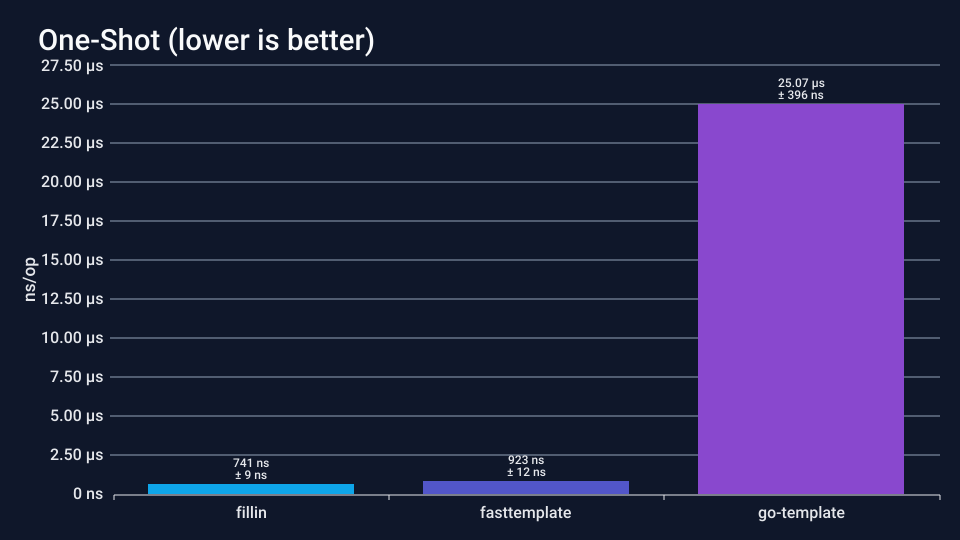
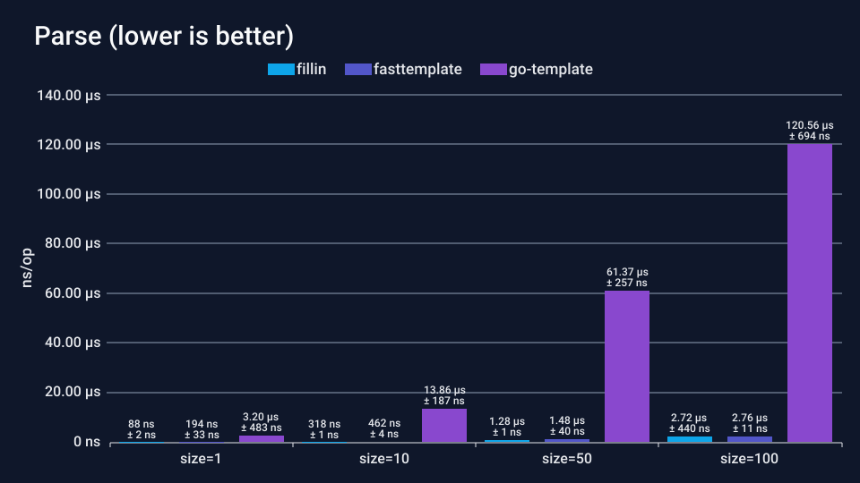
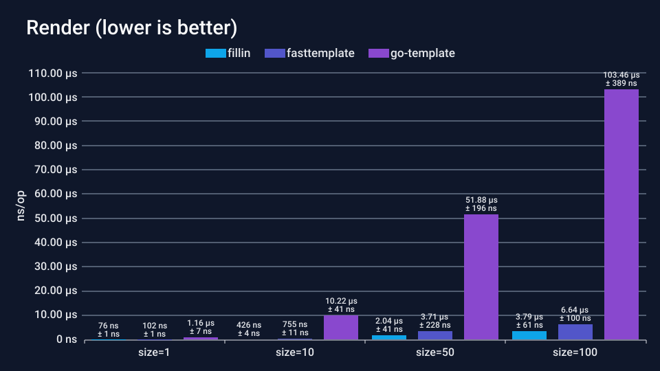

<a name="readme-top"></a>

[](https://pkg.go.dev/github.com/aisbergg/go-fillin/pkg/fillin)
[](https://codecov.io/gh/aisbergg/go-fillin)
[](https://pkg.go.dev/github.com/aisbergg/go-fillin)

<br />
<br />

<div align="center">
  <h2 align="center"><b>fillin</b></h2>

  <p align="center">
    Simple and fast string template engine for placeholder replacement
    <br />
    <br />
    <a href="https://pkg.go.dev/github.com/aisbergg/go-fillin/pkg/fillin">Explore the docs</a>
    ·
    <a href="https://github.com/aisbergg/go-fillin/issues/new?labels=bug&template=bug-report---.md">Report Bug</a>
    ·
    <a href="https://github.com/aisbergg/go-fillin/issues/new?labels=enhancement&template=feature-request---.md">Request Feature</a>
  </p>
</div>

I needed a simple, _fast_ template engine for string substitution in Go. Something like Python's lesser known String Template (I am not talking about f-strings or the new t-strings). And of course, what better way is there than just writing my own, thus _fillin_ was born!

Before I wrote _fillin_ I used Go's `text/template`, which is powerful, overkill for the use-case and I personally find it horrendous to use. Furthermore, I just found out that by just using `text/template` in your Go program you disable _Dead Code Elimination_ (DCE). Without DCE every little unused function is kept in the compiled binary, effectively bloating it.

<details open="open">
  <summary>Table of Contents</summary>

- [Features](#features)
- [Installation](#installation)
- [Usage](#usage)
- [Benchmark](#benchmark)
- [Contributing](#contributing)
- [License](#license)
- [Contact](#contact)

</details>

## Features

- **Three entry points**, one for each common shape:
    - `Render(src, ctx) ⇒ (string, error)`: returns a freshly allocated string.
    - `Append(buf, src, ctx) ⇒ ([]byte, error)`: reuses caller-provided capacity.
    - `RenderTo(w, src, ctx)` or `Template.RenderTo(w, ctx)`: streams rendered text into any `io.Writer`.
- **Configurable delimiters**: default is `{key}`, but can be chosen freely with `WithDelimiters`.
- **Case-insensitive mode**: enable with `WithCaseInsensitive()` for relaxed key matching.
- **Four error modes** for missing placeholders: `Strict` (default, return error), `Empty` (leave blank), `Keep` (preserve original), `DefaultValue` (substitute provided value).
- **Compile once, render many**: parse templates into reusable `*Template` objects via `New()`.
- **Automatic type conversion**: context values are stringified using Go's default formatting.

<p align="right"><a href="#readme-top" alt="abc"><b>back to top ⇧</b></a></p>

## Installation

```
go get -u github.com/aisbergg/go-fillin
```

<p align="right"><a href="#readme-top" alt="abc"><b>back to top ⇧</b></a></p>

## Usage

```go
package main

import (
	"fmt"
	"strings"

	"github.com/aisbergg/go-fillin/pkg/fillin"
)

func main() {
	//
	// One-shot rendering
	//

	src := "Hello {name}, welcome to {city}!"
	ctx := map[string]any{
		"name": "Alice",
		"city": "Berlin",
	}
	out, err := fillin.Render(src, ctx)
	if err != nil {
		panic(err)
	}
	fmt.Println(out)
	// Output: Hello Alice, welcome to Berlin!

	//
	// Compile once, render many times
	//

	tpl, err := fillin.New("Order #{id} for {customer}")
	if err != nil {
		panic(err)
	}
	for _, order := range []map[string]any{
		{"id": 1001, "customer": "Bob"},
		{"id": 1002, "customer": "Carol"},
	} {
		out, _ := tpl.Render(order)
		fmt.Println(out)
	}
	// Output: Order #1001 for Bob
	//         Order #1002 for Carol

	//
	// Custom delimiters
	//

	src = "Hi [[name]], you have [[count]] messages"
	tpl, _ = fillin.New(src, fillin.WithDelimiters("[[", "]]"))
	out, _ = tpl.Render(map[string]any{"name": "Dave", "count": 5})
	fmt.Println(out)
	// Output: Hi Dave, you have 5 messages

	//
	// Case-insensitive matching
	//

	tpl, _ = fillin.New("Hello {Name}!", fillin.WithCaseInsensitive())
	out, _ = tpl.Render(map[string]any{"name": "Eve"})
	fmt.Println(out)
	// Output: Hello Eve!

	//
	// Missing key handling
	//

	tpl, _ = fillin.New("Hi {user}, your code is {code}",
		fillin.WithErrorMode(fillin.DefaultValue, "N/A"))
	out, _ = tpl.Render(map[string]any{"user": "Frank"})
	fmt.Println(out)
	// Output: Hi Frank, your code is N/A

	//
	// Append to existing buffer
	//

	buf := make([]byte, 0, 64)
	buf, err = fillin.Append(buf, "Item {id}: {name}",
		map[string]any{"id": 1, "name": "Widget"})
	if err != nil {
		panic(err)
	}
	fmt.Println(string(buf))
	// Output: Item 1: Widget

	//
	// Render to an io.Writer
	//

	var bld strings.Builder
	tpl, _ = fillin.New("Template: {value}")
	tpl.RenderTo(&bld, map[string]any{"value": "test"})
	fmt.Println(bld.String())
	// Output: Template: test
}
```

<p align="right"><a href="#readme-top" alt="abc"><b>back to top ⇧</b></a></p>

## Benchmark

Inside the [benchmarks](./benchmarks) directory are benchmarks comparing fillin against Go's standard `text/template` and [fasttemplate](https://github.com/valyala/fasttemplate). You can run them with:

```shell
cd benchmarks && go test -bench=BenchmarkCompare -benchtime=1s -benchmem
```

Results on Intel i7-8550U @ 1.80GHz:







<p align="right"><a href="#readme-top" alt="abc"><b>back to top ⇧</b></a></p>

## Contributing

If you have any suggestions, want to file a bug report or want to contribute to this project in some other way, please read the [contribution guideline](CONTRIBUTING.md).

And don't forget to give this project a star 🌟! Thanks again!

<p align="right"><a href="#readme-top" alt="abc"><b>back to top ⇧</b></a></p>

## License

Distributed under the MIT License. See `LICENSE` for more information.

<p align="right"><a href="#readme-top" alt="abc"><b>back to top ⇧</b></a></p>

## Contact

André Lehmann

- Email: aisberg@posteo.de
- [GitHub](https://github.com/aisbergg)
- [LinkedIn](https://www.linkedin.com/in/andre-lehmann-97408221a/)

<p align="right"><a href="#readme-top" alt="abc"><b>back to top ⇧</b></a></p>
